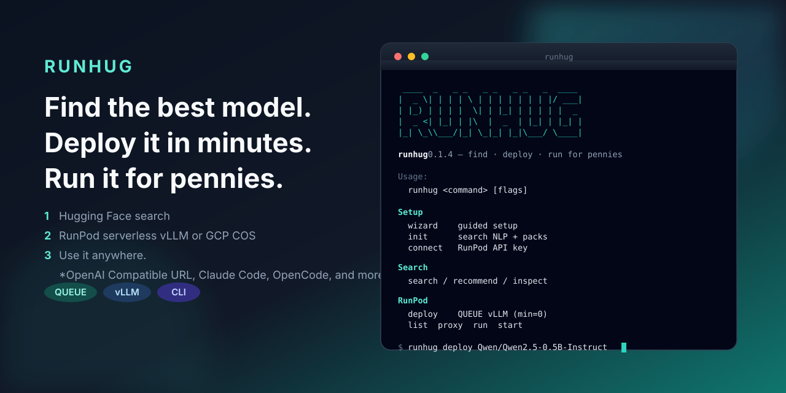
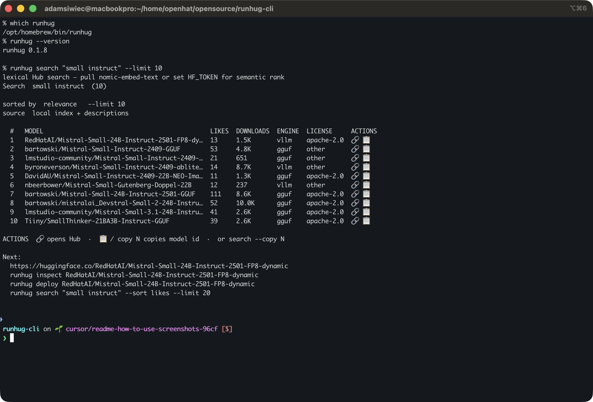
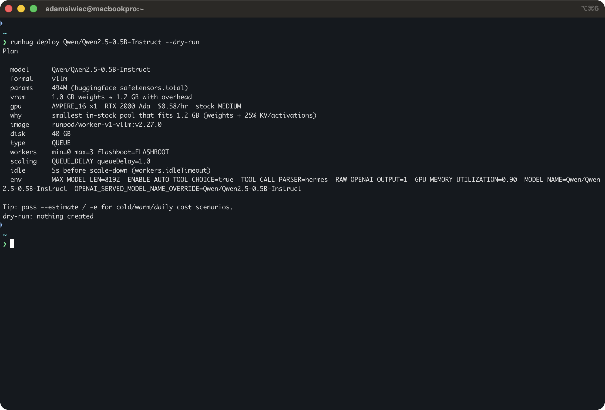
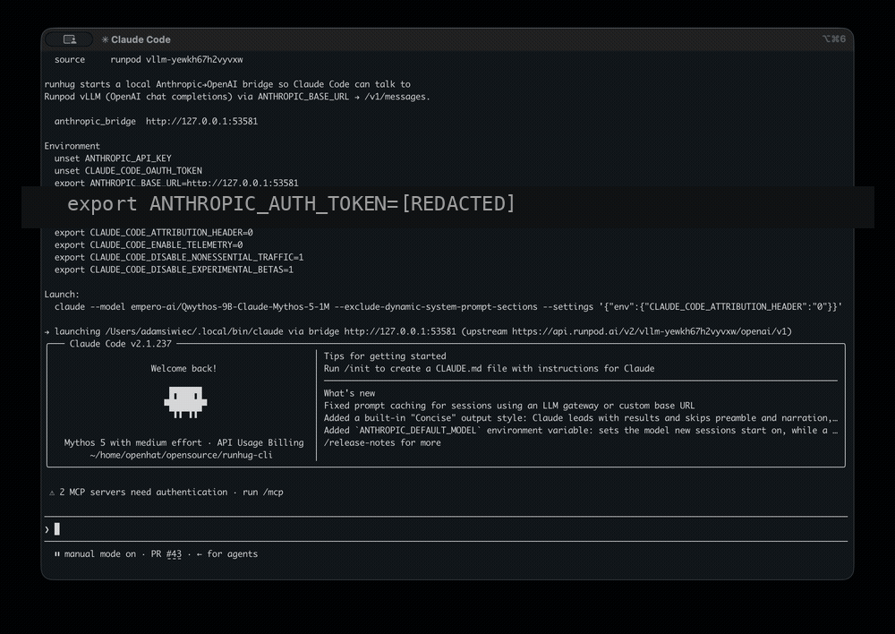

# runhug

<p align="center">
  
</p>

**Find the best model. Deploy it in minutes. Run it for pennies.**

Search Hugging Face, deploy any checkpoint (RunPod serverless vLLM or GCP Spot llama.cpp), then chat via an OpenAI-compatible URL, Claude Code, or OpenCode — including abliterated **heretic** models trained in-CLI.

<p align="center">
  
</p>

## Install

```bash
# macOS / Linux — Homebrew
brew install --cask openhat-security/tap/runhug

# Debian / Ubuntu — apt
curl -fsSL https://openhat-security.github.io/packages/install-apt.sh | sudo bash

# Fedora / RHEL — dnf
curl -fsSL https://openhat-security.github.io/packages/install-dnf.sh | sudo bash

# Arch — AUR
yay -S runhug-bin

# Windows — Scoop
scoop bucket add openhat https://github.com/openhat-security/scoop-bucket
scoop install runhug

# Windows — winget
winget install OpenHatSecurity.Runhug

# any OS — npm (Node ≥ 18)
npm install -g runhug
# or: npx runhug wizard

# macOS / Linux — direct binary
curl -fsSL https://raw.githubusercontent.com/openhat-security/runhug/main/scripts/install.sh | bash

# Windows — direct binary (PowerShell)
irm https://raw.githubusercontent.com/openhat-security/runhug/main/scripts/install.ps1 | iex

# optional — Go
go install github.com/adamsiwiec1/runhug/cmd/runhug@latest
```

Packaging details: [packaging/README.md](packaging/README.md) · Releases: [github.com/openhat-security/runhug/releases](https://github.com/openhat-security/runhug/releases)

## Quick start

```bash
runhug wizard                 # guided setup
runhug init --yes             # search NLP + index packs
runhug connect && runhug connect hf

runhug search -q "small instruct llm"
runhug deploy <model> --dry-run --estimate
runhug deploy <model>         # sampling: recommended / none / customize

runhug upgrade                # CLI via brew/scoop/npm/apt/… (or: update --cli)
runhug update                 # refresh search index / packs

runhug heretic make <org/model> --dry-run --no-upload
runhug deploy --provider gcp <gguf-model> --project <id> --dry-run
runhug gcp dockerfile --model <gguf>   # readonly pager (vim -R / less)
runhug gcp push --image REGION-docker.pkg.dev/PROJECT/runhug/llama-server:cuda
runhug gcp tunnel

runhug proxy                  # OpenAI proxy @ 127.0.0.1:8080/v1
runhug run [model]            # chat REPL
runhug start claude           # Claude Code bridge
runhug start opencode         # OpenCode bridge
```

<p align="center">
  
</p>

<p align="center">
  
</p>

<p align="center">
  
</p>

**RunPod OpenAI bases:** QUEUE `https://api.runpod.ai/v2/{id}/openai/v1` · load balancer `https://{id}.api.runpod.ai/v1`

## Tips

- Plans print essentials by default. Pass `--verbose` / `-v` for cost assumptions, env dumps, and Dockerfile on GCP dry-run.
- `--estimate` / `-e` shows cold/warm/daily cost scenarios (assumptions still need `-v`).
- `runhug help`, `runhug gcp help`, `runhug heretic help`, `runhug gpu help` — short colorized command lists.
- Other commands: `inspect`, `recommend gpu`, `update`, `gpu list|set|clear|update`, `list`, `local …`, `config get|set`.
- Env: `RUNPOD_API_KEY`, `HF_TOKEN`, `RUNHUG_CONFIG`, `NO_COLOR`, `PAGER`.

**Record the demo GIF:** `brew install vhs && make demo-vhs` → `assets/screenshots/runhug-demo.{gif,mp4}` (`demos/runhug.tape`).

## Build your own model index

`runhug init` / `update --packs` installs **community category index packs** from [GitHub Releases](https://github.com/openhat-security/runhug/releases). You can also build and contribute packs from the CLI (or via standalone [hfpacks](https://github.com/openhat-security/hfpacks)).

### Search by type and index locally

`--task` is an **exact** Hub `pipeline_tag`. `--type` is a **broad** pack bucket (expands to one or more pipelines, or `filter=gguf`).

```bash
runhug packs categories              # types + aliases
runhug search aero --type llm --online --limit 50
runhug search aero --type llm --online --index          # upsert pool; prompt to share
runhug search aero --type vision --online --index --share=false
```

`--index` upserts the search pool into `~/.config/runhug/models.db` and `packs/<type>.db` (no duplicate rows; membership is additive). After indexing, a TTY asks whether to share with the community (`--share=true|false` skips the prompt). Share requires [`gh`](https://cli.github.com/) and opens a PR on `openhat-security/runhug` with `contrib/packs/<type>/` artifacts.

### Build a full pack set

```bash
# preferred: embedded in runhug
runhug packs build --out dist/index
runhug packs upsert Qwen/Qwen3-8B --type llm

# or standalone hfpacks (proxy pool)
git clone https://github.com/openhat-security/hfpacks.git
cd hfpacks && go build -o bin/hfpacks ./cmd/hfpacks
export HF_TOKEN=hf_…
./bin/hfpacks build -out dist/index
```

Output layout:

```
dist/index/
  index-manifest.json
  index-text-generation.db
  index-vision.db
  index-text-to-image.db
  index-video.db
  index-audio.db
  index-embeddings.db
  index-gguf.db
```

### Share packs with the community

1. **Index or build** (`runhug search … --index` or `runhug packs build` / hfpacks).
2. **Verify**: `runhug search -q "…" --type …` and `runhug inspect`.
3. **Share**: accept the post-index prompt, or pass `--share=true` (needs `gh`). Alternately open a manual PR with DBs + manifest or a public download URL.
4. **Maintainers** publish Release assets so `init` / `update --packs` pick them up.

Prefer Releases (or an external URL) over committing multi‑hundred‑MB binaries to `main`. Questions: [Discussions](https://github.com/openhat-security/runhug/discussions).

## License & contributing

[LICENSE](LICENSE) · [CONTRIBUTING.md](CONTRIBUTING.md) · [SECURITY.md](SECURITY.md) · [CHANGELOG.md](CHANGELOG.md) · [SUPPORT.md](SUPPORT.md)
